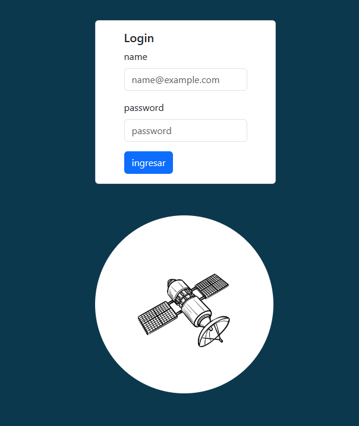

# frontend-basic-login

## Imagen de login básico



## Dockerfile

```Dockerfile
FROM nginx
COPY index.html /usr/share/nginx/html
```

```bash
docker build -t frontend-basic-login/nginx:0.0.1 .

docker run --name frontend-basic-login -d -p 8080:80 frontend-basic-login/nginx:0.0.1
```
